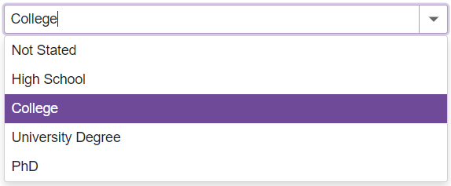

<!-- default badges list -->

[](https://supportcenter.devexpress.com/ticket/details/T1180793)
[](https://docs.devexpress.com/GeneralInformation/403183)
[](#does-this-example-address-your-development-requirementsobjectives)
<!-- default badges end -->
# ComboBox for Blazor - Bind to an enumeration

This example demonstrates how to create a wrapper class that obtains enumeration values and passes them to the ComboBox component's `Data` property.



## Overview

Follow the steps below to bind the ComboBox component to an enumeration:

1. Create a wrapper class with two properties that specify an enumeration value and a text string that the ComboBox displays.

    ```cs
    public class EducationDegree {
        // Specifies an enumeration value
        public EducationType Value { get; set; }
        // Specifies a text string
        public string DisplayName { get; set; }
    }
    ```

2. Create a [generic extension method](CS/Data/Education.cs#25) that gets the [DisplayAttribute.Name](https://learn.microsoft.com/en-us/dotnet/api/system.componentmodel.dataannotations.displayattribute.name?view=net-7.0) property value from the enumeration's member.

3. Add [the ComboBox component](CS/Shared/Combobox.razor#L4) to your project and override the [OnInitialized](https://learn.microsoft.com/en-us/aspnet/core/blazor/components/lifecycle?view=aspnetcore-7.0#component-initialization-oninitializedasync) lifecycle method. This method creates a match between enumeration member integer and string values.

    ```razor
    @code {
        // ...

        protected override void OnInitialized() {
            //...
            EducationDegrees = Enum.GetValues(typeof(EducationType))
                .OfType<EducationType>()
                .Select(t => new EducationDegree()
                {
                    Value = t,
                    DisplayName = t.GetAttribute<DisplayAttribute>().Name
                }).ToList();
            base.OnInitialized();
        }
    }
    ```

## Files to Review

- [Combobox.razor](CS/Shared/Combobox.razor)
- [Education.cs](CS/Data/Education.cs)

## Documentation

- [DxComboBox - Bind to an Enumeration](https://docs.devexpress.com/Blazor/DevExpress.Blazor.DxComboBox-2.Data#bind-to-an-enumeration)
<!-- feedback -->
## Does this example address your development requirements/objectives?

[](https://www.devexpress.com/support/examples/survey.xml?utm_source=github&utm_campaign=blazor-dxcombobox-bind-to-enum&~~~was_helpful=yes) [](https://www.devexpress.com/support/examples/survey.xml?utm_source=github&utm_campaign=blazor-dxcombobox-bind-to-enum&~~~was_helpful=no)

(you will be redirected to DevExpress.com to submit your response)
<!-- feedback end -->
